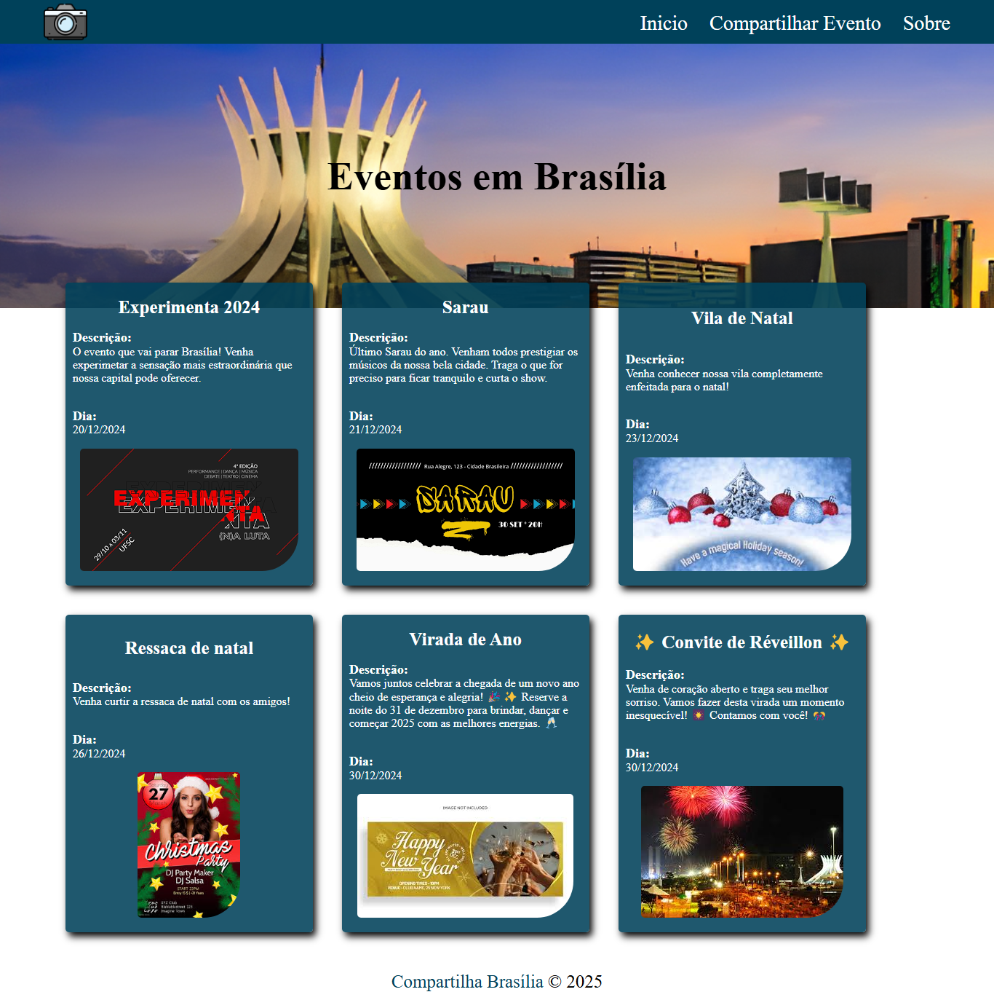

# Compartilha Brasília

O Compartilha Brasília é uma plataforma criada para conectar pessoas aos eventos e experiências incríveis que acontecem na nossa capital. Sabemos que Brasília é repleta de cultura, música, arte e momentos únicos que merecem ser compartilhados. Nosso objetivo é proporcionar um espaço onde você pode descobrir e divulgar o que há de melhor em Brasília!

## Funcionalidades

- Descobrir eventos em Brasília
- Compartilhar eventos
- Visualizar detalhes dos eventos

## Estrutura do Projeto

- `src/app/components/pages/sobre/sobre.component.html`: Página sobre o Compartilha Brasília.
- `src/app/components/pages/home/home.component.html`: Página inicial com a lista de eventos.
- `src/app/components/pages/compartilhar-evento/compartilhar-evento.component.html`: Página para compartilhar novos eventos.
- `src/app/app.component.html`: Componente principal que inclui o cabeçalho e rodapé.

## Scripts Disponíveis

No diretório do projeto, você pode executar:

### `ng serve`

Roda a aplicação em modo de desenvolvimento.\
Abra [http://localhost:4200](http://localhost:4200) para ver no navegador.

### `ng build`

Compila a aplicação para produção na pasta `dist/`.

### `ng test`

Roda os testes unitários via [Karma](https://karma-runner.github.io).

### `serve:ssr:compartilhaBrasilia`

Serve a aplicação usando server-side rendering com Express.

## Dependências

- Angular
- Express
- RxJS
- Zone.js

## Como Contribuir

1. Faça um fork do projeto.
2. Crie uma branch para sua feature (`git checkout -b feature/AmazingFeature`).
3. Commit suas mudanças (`git commit -m 'Add some AmazingFeature'`).
4. Faça um push para a branch (`git push origin feature/AmazingFeature`).
5. Abra um Pull Request.

## Contato

Se tiver dúvidas, sugestões ou feedback, entre em contato conosco!
